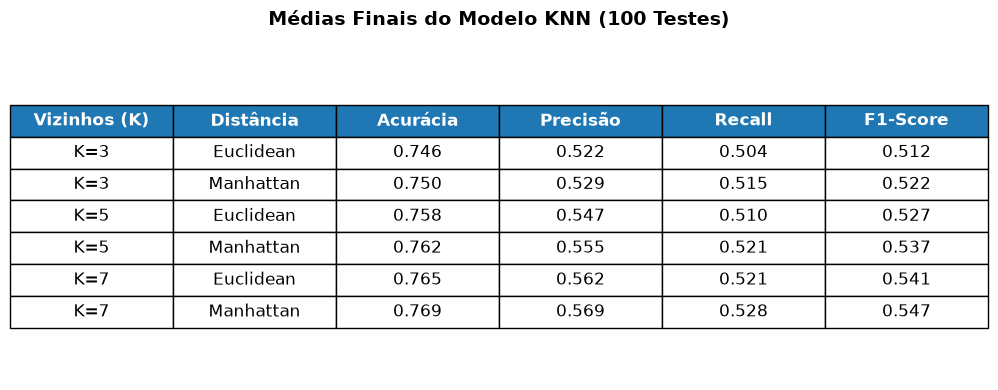
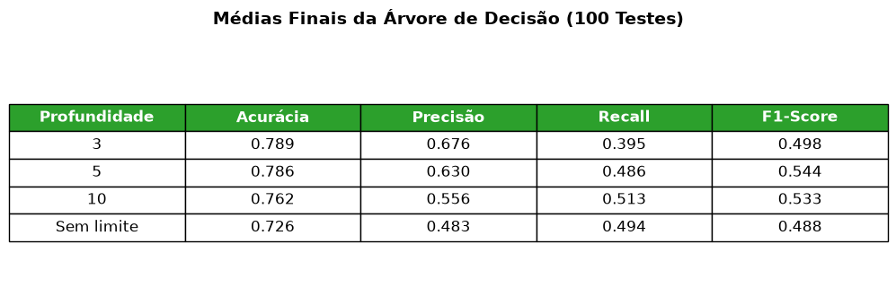
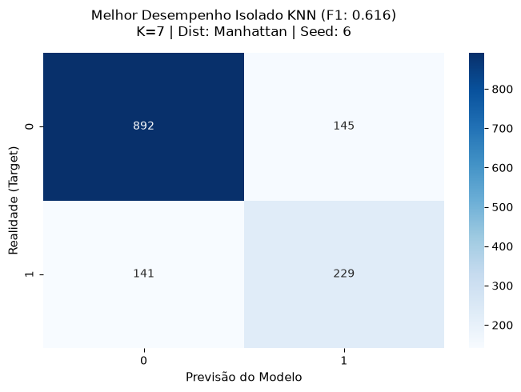
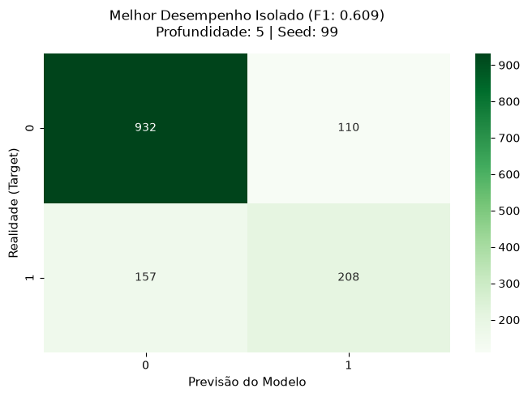

# Relatório Crítico: Previsão de Evasão de Clientes (Churn)

Neste relatório tentarei fazer a sintese de como foi o processo usado para determinar qual dos dois algoritmos é melhor para prever a evasão de clientes em uma empresa de telecomunicações.

---

## Métricas de Avaliação

Inicialmente, foram carregados os dados, pré-processados, divididos em treinamento e teste (20% dos dados), e padronizados. Meu objetivo neste momento era apenas fazer uma análise inicial, para ter uma base de comparação do desempenho dos dois algoritmos. Percebi que o melhor podia variar de acordo com a seed usada para a randomização do dataset. Por vezes, o KNN desempenhava melhor com K=7 e por vezes com K=5. A árvore de decisão também variava com a mudança de seed, podendo desempenhar melhor com 3 ou com 5 de profundidade. Ambos sob a perspectiva da acurácia.

Devido a essas inconsistências, realizei uma bateria de testes com os dois algoritmos, variando a seed de 1 a 100. Com isso, consegui ter uma ideia mais clara do desempenho de cada algoritmo a partir da acurácia média quando submetidos aos dados de teste. Foi neste momento que comecei a refletir sobre qual métrica seria mais importante para um cenário real de evasão de clientes de uma empresa de telecomunicação.

Depois de pesquisar e refletir sobre o problema, fixei o f1-score como sendo a métrica principal para a avaliação do melhor algoritmo, já que ele consegue capturar bem o trade-off entre precisão e recall. Pois, para o cenário de um falso positivo pode ser honeroso uma vez que a empresa pode ter como estratégia de retenção oferecer descontos para os clientes. Também há o cenário do falso negativo que representa a perda de um cliente, o que é ainda mais custoso para a empresa. Também avaliei a forma que o KNN lida com a variação do número de vizinhos (K) e da heurística de distância (euclidiana e manhattan). E a forma que a árvore de decisão lida com a variação da profundidade (max_depth).

Após os 100 testes (repetições), obtive os seguintes resultados:

Com base nos gráficos acima, podemos concluir que o melhor algoritmo em média, para prever a evasão de clientes é o KNN com K=7 e heurística de Manhattan, com f1-score de 0.547.

## Matriz de Confusão
Peguei a matriz de confusão do melhor modelo KNN e da Árvore de Decisão, com os parâmetros que obtive melhor desempenho na minha bateria de testes.

- **Verdadeiros Positivos (TP):** Modelo previu *Churn* e o cliente realmente evadiu.
- **Falsos Positivos (FP):** Modelo previu *Churn*, mas o cliente permaneceu.
- **Verdadeiros Negativos (TN):** Modelo previu que o cliente *Permaneceria*, e ele permaneceu.
- **Falsos Negativos (FN):** Modelo previu que o cliente *Permaneceria*, mas o cliente evadiu.

---

## Conclusão
O melhor algoritmo, seguindo os critérios definidos para avaliação, foi o KNN com K=7 e heurística de Manhattan, pois ele teve o melhor f1-score de média (0.547). O KNN também foi o melhor modelo treinado chegando a um f1-score de 0.616.